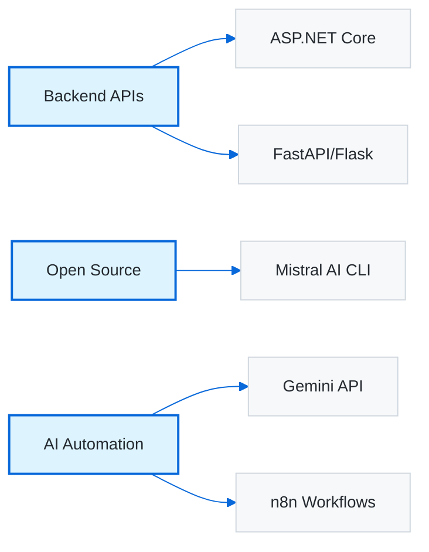

<!-- <div align="center">
  
  <h1 style="font-family: 'Segoe UI', sans-serif; color: #2d3436; text-shadow: 2px 2px 8px rgba(0,0,0,0.2); margin-top: 20px;">
    👋 Welcome to My Profile
  </h1>
  <p style="font-size: 1.2em; color: #636e72; font-family: 'Segoe UI', sans-serif; max-width: 700px;">
    2nd-Year Software Engineering Student | Backend Developer | Python Automation & Web Scraping | Flutter (Web & Mobile) | API & Chatbot Developer
  </p>
</div>

---

### 🧠 About Me

I'm a second-year Software Engineering student with a passion for developing efficient backend systems and user-friendly web/mobile apps. I specialize in Python automation, API integrations, and cross-platform development with Flutter.

```markdown
💼 Tech Stack:
- Flutter (Dart) — Web & Mobile Development
- Python — Automation, Web Scraping, Chatbots
- C++ / C# — Problem Solving, Desktop Applications
- Firebase / Supabase — Backend as a Service
- HTML, CSS, JavaScript — Front-End Essentials
- Git & GitHub — Version Control
```

🔍 Currently enhancing my backend logic, refining API development, and solving real-world automation tasks.

---

### 🔢 GitHub Stats

<p align="center">
  
</p>

---

### 📊 Most Used Languages

<p align="center">
  
</p>

---

### 🔥 GitHub Contribution Streak

<p align="center">
  
</p>

---

### 🧰 Tools I Use

```markdown
- VS Code & Dart DevTools
- GitHub & Postman
- Python Libraries: Selenium, BeautifulSoup, Pandas
- Git CLI & GitHub Desktop
- Firebase Console & Supabase Studio
```

---

### 🚧 Currently Working On
- Automation for a youtube,Instagram,X (currently twitter)
- Python Bots for Automation Tasks (e.g. Data Collection)
- REST API Projects with Firebase & Supabase
- Data Structures & Algorithms (DSA) Practice

---

<p align="center">
  <i>“Write code as if the next person to maintain it is a psychopath who knows where you live.”</i>
</p>

--- -->

<!-- /////////// -->
<div align="center">

# Sulman Farooq

### .NET Backend Developer | AI Automation Engineer | Open-Source Contributor

[](https://www.linkedin.com/in/sulmanfarooqq)
[](mailto:sulmanfarooq27@gmail.com)
[](https://github.com/SulmanFarooqq)

</div>

---

<table>
<tr>
<td width="50%" valign="top">

### 👨‍💻 About

Software Engineering student at **MUST** (CGPA: 3.7/4.0)

Building production backend systems with:
- ASP.NET Core & C#
- Python (FastAPI/Flask)
- PostgreSQL & Supabase
- AI Automation & Agents

Currently contributing to **Mistral AI** open-source projects.

**Seeking:** Remote Backend/AI internships

</td>
<td width="50%">


</td>
</tr>
</table>

---

### 🛠️ Tech Stack

<div align="center">


</div>

---

### 📊 GitHub Activity

<div align="center">


</div>

---

### 🎯 Current Work

<div align="center">



</div>

---

### 🏆 Experience & Certifications

<table width="100%">
<tr>
<td width="60%">

**Open-Source Contributor** @ Mistral AI  
*Nov 2025 - Present*
- Contributing to Mistral CLI
- Active code reviews & PRs
- Issue resolution

</td>
<td width="40%">

**Certifications:**
- AWS Solutions Architecture
- JPMorgan Software Engineering
- Introduction to AI

</td>
</tr>
</table>

---

<div align="center">

### 📫 Let's Connect

[](https://www.linkedin.com/in/sulmanfarooqq)
[](mailto:sulmanfarooq27@gmail.com)


*Building scalable systems, one commit at a time* 🚀

</div>