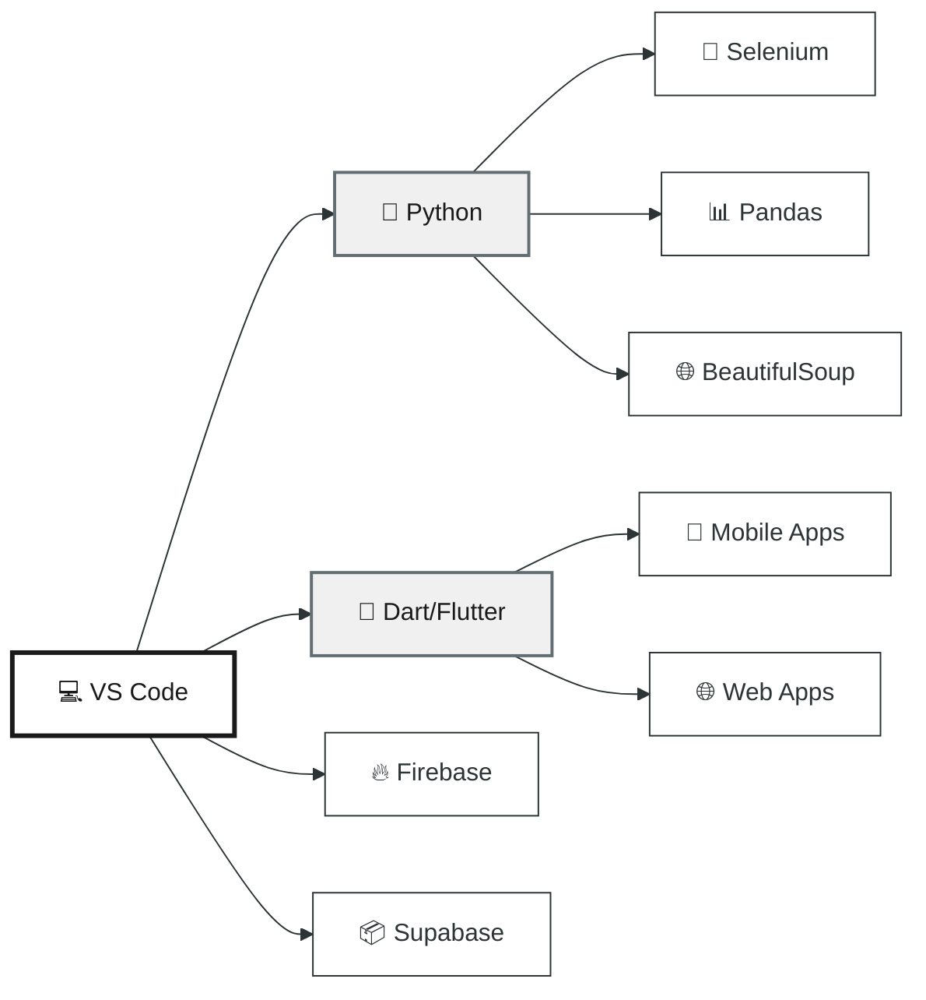

<!-- <div align="center">
  
  <h1 style="font-family: 'Segoe UI', sans-serif; color: #2d3436; text-shadow: 2px 2px 8px rgba(0,0,0,0.2); margin-top: 20px;">
    👋 Welcome to My Profile
  </h1>
  <p style="font-size: 1.2em; color: #636e72; font-family: 'Segoe UI', sans-serif; max-width: 700px;">
    2nd-Year Software Engineering Student | Backend Developer | Python Automation & Web Scraping | Flutter (Web & Mobile) | API & Chatbot Developer
  </p>
</div>

---

### 🧠 About Me

I'm a second-year Software Engineering student with a passion for developing efficient backend systems and user-friendly web/mobile apps. I specialize in Python automation, API integrations, and cross-platform development with Flutter.

```markdown
💼 Tech Stack:
- Flutter (Dart) — Web & Mobile Development
- Python — Automation, Web Scraping, Chatbots
- C++ / C# — Problem Solving, Desktop Applications
- Firebase / Supabase — Backend as a Service
- HTML, CSS, JavaScript — Front-End Essentials
- Git & GitHub — Version Control
```

🔍 Currently enhancing my backend logic, refining API development, and solving real-world automation tasks.

---

### 🔢 GitHub Stats

<p align="center">
  
</p>

---

### 📊 Most Used Languages

<p align="center">
  
</p>

---

### 🔥 GitHub Contribution Streak

<p align="center">
  
</p>

---

### 🧰 Tools I Use

```markdown
- VS Code & Dart DevTools
- GitHub & Postman
- Python Libraries: Selenium, BeautifulSoup, Pandas
- Git CLI & GitHub Desktop
- Firebase Console & Supabase Studio
```

---

### 🚧 Currently Working On
- Automation for a youtube,Instagram,X (currently twitter)
- Python Bots for Automation Tasks (e.g. Data Collection)
- REST API Projects with Firebase & Supabase
- Data Structures & Algorithms (DSA) Practice

---

<p align="center">
  <i>“Write code as if the next person to maintain it is a psychopath who knows where you live.”</i>
</p>

--- -->

<!-- /////////// -->
<div align="center">

<!-- Animated Header with Typing Effect -->


<!-- Profile Banner with Custom Design -->


<!-- Animated Badges -->
<p>
  
  
  
</p>

<!-- Animated GIF or Visual Element -->


</div>

---

## 🎯 About Me


```yaml
Name: Sulman Farooq
Location: Pakistan 🇵🇰
Education: Software Engineering (Year 2)
Focus: Backend Development & Automation
Passion: Solving Real-World Problems with Code
Current Mission: Building Scalable Systems

Learning:
  - Advanced Python Development
  - API Architecture & Design
  - Data Structures & Algorithms
  - Cross-Platform Development
  
Fun Fact: "I debug with coffee and determination ☕"
```

<br clear="right"/>

---

## 💻 Tech Stack Universe

<div align="center">

<!-- Animated Tech Stack -->


<br><br>

<!-- Tech Proficiency Visualization -->
<table>
<tr>
<td width="50%">

### 🐍 Backend & Automation
```text
Python           ████████████████████░   95%
API Development  ███████████████████░░   90%
Web Scraping     ██████████████████░░░   85%
Chatbots         █████████████████░░░░   80%
Firebase/Supabase███████████████████░░   88%
```

</td>
<td width="50%">

### 📱 Frontend & Mobile
```text
Flutter (Dart)   ███████████████████░░   90%
HTML/CSS         ██████████████████░░░   85%
JavaScript       ████████████████░░░░░   75%
Responsive Design████████████████████░   92%
UI/UX Principles ███████████████░░░░░░   70%
```

</td>
</tr>
</table>

</div>

---

## 📊 GitHub Analytics Dashboard

<div align="center">

<!-- Stats Cards with White Theme -->


<!-- Languages Graph -->


<!-- Activity Graph -->


<!-- Contribution Graph with White Theme -->


<!-- Trophy Section -->


</div>

---

## 🚀 Current Projects & Focus

<div align="center">

<table>
<tr>
<td width="33%" align="center">

### 🤖 Automation Suite


**Social Media Bots**
- YouTube Automation
- Instagram Scheduler
- X (Twitter) Analytics

</td>
<td width="33%" align="center">

### 🔌 API Development


**REST APIs**
- Firebase Integration
- Supabase Backend
- Custom Endpoints

</td>
<td width="33%" align="center">

### 📚 DSA Practice


**Problem Solving**
- LeetCode Daily
- Algorithm Design
- Optimization

</td>
</tr>
</table>

</div>

---

## 🛠️ Development Environment

<div align="center">


</div>

---

## 📈 Coding Activity Infographic

<div align="center">

<!-- Activity Metrics -->
<table>
<tr>
<td align="center" width="25%">
<br>

</td>
<td align="center" width="25%">
<br>

</td>
<td align="center" width="25%">
<br>

</td>
<td align="center" width="25%">
<br>

</td>
</tr>
</table>

</div>

---

## 🎨 Skills Breakdown

<div align="center">

<!-- Interactive Skill Bars -->
| Skill Category | Technologies | Proficiency |
|:---|:---|:---|
| **🐍 Backend Development** | Python, Flask, FastAPI, REST APIs |  |
| **📱 Mobile Development** | Flutter, Dart, Firebase, Supabase |  |
| **🤖 Automation & Scraping** | Selenium, BeautifulSoup, Pandas |  |
| **💾 Databases** | Firebase, Supabase, SQLite |  |
| **🔧 DevOps & Tools** | Git, GitHub, Postman, VS Code |  |
| **🌐 Web Technologies** | HTML, CSS, JavaScript, Responsive Design |  |

</div>

---

## 🌟 Featured Repositories

<div align="center">

<!-- Repo Cards -->
<a href="https://github.com/SulmanFarooqq?tab=repositories">
  
</a>
<a href="https://github.com/SulmanFarooqq?tab=repositories">
  
</a>

</div>

---

## 💭 Developer Quote

<div align="center">


</div>

---

## 🤝 Let's Connect

<div align="center">

<!-- Social Links with Hover Effect -->
<a href="https://github.com/SulmanFarooqq" target="_blank">
  
</a>
<a href="https://linkedin.com/in/yourprofile" target="_blank">
  
</a>
<a href="mailto:your.email@example.com">
  
</a>
<a href="https://twitter.com/yourhandle" target="_blank">
  
</a>

<br><br>

<!-- Profile Views Counter -->


</div>

---

<div align="center">

<!-- Animated Snake -->
<picture>
  <source media="(prefers-color-scheme: light)" srcset="https://raw.githubusercontent.com/SulmanFarooqq/SulmanFarooqq/output/github-contribution-grid-snake-default.svg">
  
</picture>

<!-- Footer Wave -->


### ✨ *"Code is poetry written in logic"* ✨

</div>