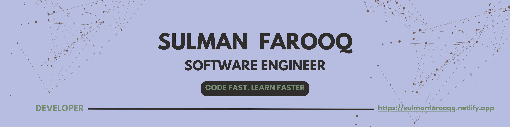

  <h1 style="color: #2d3436; font-family: 'Segoe UI', sans-serif; text-shadow: 2px 2px 8px rgba(0,0,0,0.2);">✨ Welcome to My Profile ✨</h1>
  
  

    
    
    
  

  
<strong>Engineering dreams, filming reality</strong>

  <h2 style="color: #2d3436; font-family: 'Segoe UI', sans-serif; text-shadow: 1px 1px 6px rgba(0,0,0,0.2);">👋 Hi, I'm Sulman </h2>
  
  <h3 style="color: #2d3436; font-family: 'Segoe UI', sans-serif; text-shadow: 1px 1px 4px rgba(0,0,0,0.15);">🚀 Aspiring Software Engineer | Passionate Photographer </h3>

  <ul style="list-style-type: none; padding-left: 0;">
    <li style="margin: 10px 0;">👨‍🎓 Pursuing a career in Software Engineering with a strong focus on building innovative solutions.</li>
    <li style="margin: 10px 0;">📸 Hobbyist Photographer & Filmmaker — exploring old aesthetics, moody object photography & vintage architecture.</li>
    <li style="margin: 10px 0;">📈 Constantly learning and building projects in Backend Development (Node.js, Supabase), Flutter & C++.</li>
    <li style="margin: 10px 0;">💡 Passionate about crafting efficient, clean code and problem-solving through technology.</li>
    <li style="margin: 10px 0;">🎯 Focused on developing practical applications for students, creators & indie developers.</li>
    <li style="margin: 10px 0;">💻 I believe in the power of creativity over expensive gear and optimize for impactful results.</li>
    <li style="margin: 10px 0;">🌙 Often found coding and refining projects late at night — in 'deep work' mode! 😄</li>
  </ul>

  <h3 style="color: #2d3436; font-family: 'Segoe UI', sans-serif; text-shadow: 1px 1px 4px rgba(0,0,0,0.15);">🤝 Connect with me:</h3>
  

    
    
  

  <h3 style="color: #2d3436; font-family: 'Segoe UI', sans-serif; text-shadow: 1px 1px 4px rgba(0,0,0,0.15);">💻 Tech Stack I Use</h3>
  
  <h4 style="color: #2d3436; font-family: 'Segoe UI', sans-serif; margin-top: 20px; text-shadow: 1px 1px 3px rgba(0,0,0,0.1);">📚 Programming Languages</h4>
  

    
    
    
    
    
    
    
    
  

  <h4 style="color: #2d3436; font-family: 'Segoe UI', sans-serif; margin-top: 20px; text-shadow: 1px 1px 3px rgba(0,0,0,0.1);">☁️ Platforms & Services</h4>
  

    
    
    
    
    
    
    
    
    
    
  

  <h3 style="color: #2d3436; font-family: 'Segoe UI', sans-serif; text-shadow: 1px 1px 4px rgba(0,0,0,0.15);">🛠 Tools I Love</h3>
  

    
    
    
    
    
  

  <h3 style="color: #2d3436; font-family: 'Segoe UI', sans-serif; text-shadow: 1px 1px 4px rgba(0,0,0,0.15);">📊 GitHub Analytics</h3>
  <table>
    <tr>
      <td>
        
      </td>
      <td>
        
      </td>
    </tr>
  </table>

[instagram]: https://www.instagram.com/sulmanfarooqq

Contribution: 2025-06-25 00:00

Contribution: 2025-06-25 00:00

Contribution: 2025-06-28 00:00

Contribution: 2025-06-28 00:30

Contribution: 2025-06-27 00:00

Contribution: 2025-06-29 00:00

Contribution: 2025-05-07 00:00

